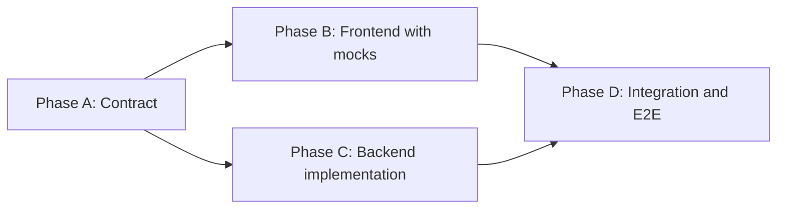

# Node Core Lab Roadmap

The canonical plan for the project: goal, current status, stack, delivery workflow, and the order in which to work. Every other roadmap is a detail view of one row in the [Stage map](#stage-map).

## Project Goal

A senior-level full-stack learning monorepo. The **frontend is built once** (Next.js, fully usable on mocks) and acts as a realistic client. The **backend is the learning track**: Fastify + TypeScript, implemented module by module until the same UI runs against a real service.

Aim for senior-level depth — not "it works" but "I can explain every layer".

## Current Status

> Update this block whenever a stage changes state. It is the one place to answer "where am I?".

| Stage | Status |
| --- | --- |
| Node.js Fundamentals (labs 01–12) | ✅ Done — self-check the Learning Outcomes in [node-fundamentals-roadmap](./node-fundamentals-roadmap.md) |
| Frontend on mocks (all five modules) | ✅ Done — remaining gaps in [frontend-roadmap](./frontend-roadmap.md#remaining-gaps) |
| Backend Foundation | 🟡 In progress — `config/env.ts`, `lib/request-context.ts`, `lib/result.ts`, Compose done; see [foundation.md](./foundation.md#fill-in-order-and-status) |
| Contracts (Phase A) | ⬜ Stubs only — derive from `@repo/types` + `real*` adapters (see [workflow](#module-delivery-workflow)) |
| Backend modules M1–M13 | ⬜ Not started |

**Next step:** finish Foundation (`app.ts` → `server.ts` → plugins → `/live`), then freeze the Auth contract.

## Stack

Single source of truth for technology choices. Other docs link here instead of repeating the list.

| Area | Choice | State |
| --- | --- | --- |
| Monorepo | Turborepo + pnpm workspaces | In use |
| Frontend | Next.js 15 (App Router), React 18, CSS Modules (no Tailwind), TanStack Query, React Hook Form + Zod | In use |
| Backend framework | Fastify 5, `fastify-type-provider-zod` | Installed |
| Validation | Zod | In use (`config/env.ts`) |
| Database | PostgreSQL 16 (Docker Compose) | Running locally |
| ORM / query layer | Drizzle (`drizzle-orm`, `drizzle-kit`, `postgres`) — installed; Prisma was the alternative | **ADR pending** |
| Cache, pub/sub | Redis 7 via `ioredis` | Installed |
| Queue | BullMQ | Planned (M4) — ADR pending |
| Email | Provider-agnostic `Mailer`; `nodemailer` + MailHog in dev | Installed |
| API docs | `@fastify/swagger` + `@fastify/swagger-ui` | Installed |
| Auth | JWT access tokens, refresh rotation in HttpOnly cookies, argon2id, optional TOTP, OAuth/OIDC (Google, GitHub) | Planned (M1) |
| Realtime | Native WebSocket (`@fastify/websocket`) — the frontend already uses a plain `WebSocket` on `/api/chat/ws`, so Socket.io would require client changes | Planned (M5) — ADR pending |
| Observability | Pino, OpenTelemetry, Prometheus, Sentry | Planned (M10) |
| Testing | Vitest, Fastify `inject`, Testcontainers, Playwright, k6 / autocannon | Planned (Foundation → M11) |
| Shared packages | `@repo/types` (DTOs), `@repo/config` (tsconfig presets); `@repo/ui` optional, not created | In use |

## Stage Map

One table, one order. Module numbers (M1…M13) are stable IDs used in anchors and contracts; the **Order** column is the recommended sequence. They differ on purpose: M6 Caching builds on M2 Search, and M5 Chat is more valuable after queues and Redis are familiar.

| Order | Stage | Uses labs | Architecture sections applied | Backend | Frontend | Contract |
| --- | --- | --- | --- | --- | --- | --- |
| 0 | Node.js Fundamentals | 01–12 | — | [roadmap](./node-fundamentals-roadmap.md) | — | — |
| 1 | Foundation | 06, 08, 12 | §4 Errors, §9 Config, §10 Observability hooks | [Foundation](./backend-roadmap.md#foundation) · [map](./foundation.md) | [Foundation](./frontend-roadmap.md#foundation) | — |
| 2 | M1 Auth & Security | 10 | §0 ADRs, §1 Layering, §2 DI, §3 Repositories, §5 API design, §6 Validation | [M1](./backend-roadmap.md#module-1-auth--security) | [M1](./frontend-roadmap.md#module-1-auth--security) | [auth](./contracts/auth.md) |
| 3 | M2 Database Performance & Search | — | §5 Pagination, §11 Concurrency, §14 PII (users exist now) | [M2](./backend-roadmap.md#module-2-database-performance--search) | [M2](./frontend-roadmap.md#module-2-high-performance-search) | [search](./contracts/search.md) |
| 4 | M6 Caching | — | §7 Caching strategy | [M6](./backend-roadmap.md#module-6-caching) | — | — |
| 5 | M3 File Streaming & Processing | 03, 04, 05 | — | [M3](./backend-roadmap.md#module-3-file-streaming--processing) | [M3](./frontend-roadmap.md#module-3-file-streaming--processing) | [files](./contracts/files.md) |
| 6 | M4 Background Jobs & Workers | 05, 08 | §8 Domain events & outbox | [M4](./backend-roadmap.md#module-4-background-jobs--workers) | [M4](./frontend-roadmap.md#module-4-task-queue--background-processing) | [jobs](./contracts/jobs.md) |
| 7 | M7 Webhooks | 10 | §8 Outbox, §11 Idempotency | [M7](./backend-roadmap.md#module-7-webhooks) | — | — |
| 8 | M8 Scheduled Jobs | — | §14 Retention jobs | [M8](./backend-roadmap.md#module-8-scheduled-jobs) | — | — |
| 9 | M9 Email & Notifications | — | — | [M9](./backend-roadmap.md#module-9-email--notifications) | — | — |
| 10 | M5 Real-time Chat & WebSockets | 09 | — | [M5](./backend-roadmap.md#module-5-real-time-chat--websockets) | [M5](./frontend-roadmap.md#module-5-real-time-chat--websockets) | [chat](./contracts/chat.md) |
| 11 | M10 Observability | 11 | §10 Observability hooks | [M10](./backend-roadmap.md#module-10-observability) | — | — |
| 12 | M11 Testing Strategy | 11 | — | [M11](./backend-roadmap.md#module-11-testing-strategy) | [Quality](./frontend-roadmap.md#quality) | — |
| 13 | M12 Deployment & CI | 12 | §13 Secret management | [M12](./backend-roadmap.md#module-12-deployment--ci) | — | — |
| 14 | M13 Library Publishing Lab | 07 | — | [M13](./backend-roadmap.md#module-13-library-publishing-lab) | — | — |

[Architecture](./architecture-roadmap.md) is **cross-cutting**: don't finish it up front. Apply each section in the stage listed above and tick it there.

## Module Delivery Workflow

Every product module (Auth, Search, Files, Jobs, Chat) goes through four phases. Frontend and backend stay aligned by pointing at one contract file in [`docs/contracts/`](./contracts), not by linking to each other.



- **Phase A — Contract:** DTOs in `packages/types/src/<module>.ts`; `docs/contracts/<module>.md` covers endpoints, errors, events, pagination, and idempotency.
- **Phase B — Frontend:** pages, hooks, and mock adapters that match the contract. The UI works with no backend.
- **Phase C — Backend:** Fastify routes, services, repositories, migrations, and tests, consuming the same DTOs from `@repo/types`.
- **Phase D — Integration:** set `NEXT_PUBLIC_API_MODE=real`, add a happy-path E2E test, and confirm the endpoints appear in logs, traces, and metrics.

### How this project deviates

Phase B was done first for all five modules, so the DTOs and routes already exist in code. **Phase A here means extracting and freezing the contract from what exists**, not designing from scratch:

1. Read `packages/types/src/<module>.ts` (DTOs) and the `real*` object in `apps/web/src/lib/api/<module>.ts` (routes). Each contract stub lists the routes the frontend already calls.
2. Write them into the contract, then resolve the gaps it lists: missing endpoints, inconsistent prefixes, undefined error codes.
3. If the contract changes a shape, update `@repo/types` and the mock adapter in the same PR so Phase B stays true.
4. Mark the contract `Frozen` before starting Phase C.

### Workflow rules

- Phase C never starts before the contract is `Frozen`.
- The frontend depends on the contract, never on a running backend.
- The backend never invents a response shape; it consumes `@repo/types`.
- Integration is its own phase, not a side effect of finishing Phase C.
- A module is done only when Phase D is complete and its Learning Outcomes are checked.

### Per-module checklist

Copy into the PR description or tracking issue for each product module.

```md
- [ ] A: Contract extracted from `@repo/types` + `real*` adapter; gaps resolved; status `Frozen`
- [ ] A: ADRs for the module's decisions written and linked from the contract
- [ ] C: Migrations applied; routes, services, repositories implemented
- [ ] C: Unit + integration tests pass (Fastify `inject`, Testcontainers)
- [ ] D: `NEXT_PUBLIC_API_MODE=real` — the module's pages work end to end
- [ ] D: Happy-path E2E test passes
- [ ] D: Logs, traces, and metrics visible for the new endpoints
- [ ] Learning Outcomes checked in backend-roadmap.md
```

## Working Habits

- Treat each stage as a sequence of small, demoable PRs (the repo already uses one branch + PR per lab — keep that).
- Record every non-trivial decision as an ADR ([process](./adr/README.md)). The [ADR backlog](./adr/README.md#backlog) lists which one each stage needs.
- Tick tasks when the code is merged; tick Learning Outcomes only when you can explain them aloud without notes.
- Update [Current Status](#current-status) at the end of each stage.

## Skills You Will Master

- Node.js runtime: event loop, libuv, streams, workers, AsyncLocalStorage.
- TypeScript at the architecture level: domain types, contracts, generic repositories.
- Fastify plugin architecture and lifecycle hooks.
- PostgreSQL: indexes, transactions, isolation, locking, query plans.
- Authentication, refresh rotation, 2FA, OAuth 2.0 / OIDC with PKCE.
- Streaming uploads, range requests, media processing.
- Queues, workers, retries, DLQ, idempotency, outbox.
- WebSockets, presence, scaling with Redis pub/sub.
- Caching strategies and HTTP caching.
- Webhooks and event-driven design.
- Observability: structured logs, traces, metrics, error reporting.
- Testing strategy: unit, integration, contract, load, mutation.
- CI/CD, Docker, migrations, production readiness.
- Secret management, PII handling, GDPR rights, OWASP Top 10.
- ADRs as a habit, not a ceremony.
- Publishing a typed dual ESM/CJS library to GitHub Packages.

## Success Criteria

You can claim this project as proof of senior-level Node.js when you can:

- [ ] Walk a stranger through the architecture in 15 minutes without notes.
- [ ] Explain every dependency in `package.json` and why it is there.
- [ ] Reproduce a CPU bottleneck and a memory leak, and fix them with profiling tools.
- [ ] Explain refresh token rotation and reuse detection on a whiteboard.
- [ ] Compare offset and cursor pagination on a real dataset with numbers.
- [ ] Show how a single failing request appears in logs, traces, and metrics.
- [ ] Run the full test suite locally and in CI, including load tests.
- [ ] Walk through OWASP Top 10 and point to the mitigation for each item in this codebase.
- [ ] Demonstrate Sign in with Google or GitHub end to end and explain the PKCE flow.
- [ ] Publish a package to GitHub Packages and consume it from another app in this repo.
- [ ] Show the ADR folder and explain a past decision using its alternatives section.
