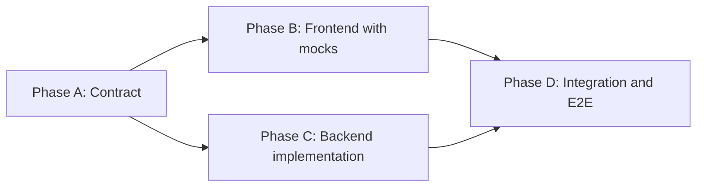

# Node Core Lab Roadmap

## Project Goal

Create a senior-level full stack learning monorepo based on Turborepo with:

- Frontend: Next.js App Router with CSS Modules.
- Backend: Node.js with TypeScript and Fastify.
- Database: PostgreSQL with Prisma or Drizzle.
- Cache and queues: Redis.
- Shared contracts: `@repo/types` for DTOs and API contracts.
- Local development: one command to run the full workspace through `pnpm dev`.

The frontend should be production-like and fully usable with mocks while the backend is implemented step by step as Node.js learning tasks. The backend is the main learning track; the frontend is built once and reused as a realistic client for every backend module.

## Recommended Stack

- Monorepo: Turborepo + pnpm workspaces.
- Frontend: Next.js, React, CSS Modules, Zod, TanStack Query.
- Backend: Fastify, TypeScript, PostgreSQL, Redis.
- ORM: Drizzle for SQL learning, or Prisma for faster delivery.
- Auth: JWT access tokens, refresh token rotation, HttpOnly cookies, optional TOTP.
- Realtime: Socket.io or native WebSocket.
- Background jobs: BullMQ + Redis.
- Email: provider-agnostic `Mailer` with MailHog for development.
- Observability: Pino, OpenTelemetry, Prometheus, Sentry.
- Testing: Vitest, Supertest / Fastify inject, Testcontainers, Playwright, k6 / autocannon.
- Shared packages: `@repo/types`, `@repo/ui`, `@repo/config`.

## Skills You Will Master

- [ ] Node.js runtime: event loop, libuv, streams, workers, AsyncLocalStorage.
- [ ] TypeScript at the architecture level: domain types, contracts, generics for repositories.
- [ ] Fastify plugin architecture and lifecycle hooks.
- [ ] PostgreSQL: indexes, transactions, isolation, locking, query plans.
- [ ] Authentication, refresh rotation, 2FA, account safety.
- [ ] OAuth 2.0 / OIDC client integration with PKCE and ID token verification.
- [ ] Streaming uploads, range requests, media processing.
- [ ] Queues, workers, retries, DLQ, idempotency.
- [ ] WebSockets, presence, scaling with Redis pub/sub.
- [ ] Caching strategies and HTTP caching.
- [ ] Webhooks (inbound and outbound) and event-driven design.
- [ ] Observability: structured logs, traces, metrics, error reporting.
- [ ] Testing strategy: unit, integration, contract, load, mutation.
- [ ] CI/CD, Docker, migrations, production readiness.
- [ ] Secret management and rotation across dev, CI, and production.
- [ ] PII classification, encryption at rest, and GDPR rights (access, erasure).
- [ ] OWASP Top 10 mitigations applied to a real service.
- [ ] Architecture Decision Records as a habit, not a ceremony.
- [ ] Publishing a typed Node.js library with semver and dual ESM/CJS builds to GitHub Packages.

## How to Use This Roadmap

- Treat each milestone as a sequence of small, demoable steps.
- For every backend module, finish the matching item in the [Node.js Fundamentals Roadmap](./node-fundamentals-roadmap.md) first.
- Apply the patterns from [Architecture Roadmap](./architecture-roadmap.md) inside every backend module.
- Use the frontend roadmap to keep the UI realistic and unblocked while the backend grows.
- Record every non-trivial decision as an ADR in [`docs/adr/`](./adr) using the template at [`docs/adr/_template.md`](./adr/_template.md).
- Mark progress with the checkboxes in each file. Aim to finish "Learning Outcomes" before moving on, not just the tasks.

## Module Delivery Workflow

Every product module is delivered through the same four phases. Frontend and backend stay aligned not by linking to each other, but by both pointing at a single contract file in [`docs/contracts/`](./contracts).

- Phase A — Contract: write DTOs in `packages/types/src/<module>.ts` and fill `docs/contracts/<module>.md` (overview, endpoints, errors, events, pagination, idempotency).
- Phase B — Frontend: build pages, forms, hooks, and mock adapters that match the contract exactly. The UI must be fully usable before the backend exists.
- Phase C — Backend: implement Fastify routes, services, repositories, migrations, and tests. The backend consumes the same DTOs from `@repo/types`.
- Phase D — Integration: replace mocks with the real API client, add an end-to-end test for the happy path, and confirm the new endpoints appear in logs, traces, and metrics.

### Workflow rules

- Always start with Phase A. Do not write code before the contract is drafted.
- The frontend never depends on a real backend. It depends on the contract.
- The backend never invents a response shape. It consumes the contract.
- Integration is a separate phase, not a side effect of finishing Phase C.
- A module is "done" only when Phase D is complete and Learning Outcomes are checked.

### Repository layout (target)

- `apps/web` — Next.js frontend.
- `apps/api` — Fastify backend.
- `apps/api/labs` — standalone Node.js labs from the [fundamentals roadmap](./node-fundamentals-roadmap.md).
- `packages/types` — shared DTOs (`@repo/types`).
- `packages/ui` — optional shared UI components.
- `packages/config` — shared tsconfig, eslint, prettier.
- `docs/contracts/<module>.md` — one contract per module.
- `docs/runbooks/<module>.md` — optional, added during the Observability module.

## Per-Module Checklist

Copy this checklist into the tracking note for every product module (Auth, Search, Files, Jobs, Chat). It applies the same way each time.

- [ ] Phase A: Contract written in `docs/contracts/<module>.md`.
- [ ] Phase A: DTOs added to `packages/types/src/<module>.ts`.
- [ ] Phase A: Open questions in the contract are resolved and the status is `Frozen`.
- [ ] Phase B: Frontend pages and hooks built against mocks.
- [ ] Phase B: Mock adapter matches the contract.
- [ ] Phase B: Loading, empty, error, and unauthorized states implemented.
- [ ] Phase C: Fastify routes implemented.
- [ ] Phase C: Database migrations applied.
- [ ] Phase C: Backend unit and integration tests pass.
- [ ] Phase D: Mocks replaced with real API client.
- [ ] Phase D: End-to-end test for the happy path passes.
- [ ] Phase D: Logs, traces, and metrics visible for the new endpoints.
- [ ] Learning Outcomes for the module are checked off in [`backend-roadmap.md`](./backend-roadmap.md).

## Milestones Overview

| # | Milestone | Files |
| - | --------- | ----- |
| 0 | Node.js Fundamentals Lab | [node-fundamentals-roadmap](./node-fundamentals-roadmap.md) |
| 1 | Monorepo Foundation | [backend](./backend-roadmap.md#foundation), [frontend](./frontend-roadmap.md#foundation-tasks) |
| 2 | Architecture & API Design | [architecture](./architecture-roadmap.md) |
| 3 | Auth & Security | [backend](./backend-roadmap.md#module-1-auth--security), [frontend](./frontend-roadmap.md#module-1-auth--security) |
| 4 | Database Performance & Search | [backend](./backend-roadmap.md#module-2-database-performance--search), [frontend](./frontend-roadmap.md#module-2-high-performance-search) |
| 5 | File Streaming & Processing | [backend](./backend-roadmap.md#module-3-file-streaming--processing), [frontend](./frontend-roadmap.md#module-3-file-streaming--processing) |
| 6 | Background Jobs & Workers | [backend](./backend-roadmap.md#module-4-background-jobs--workers), [frontend](./frontend-roadmap.md#module-4-task-queue--background-processing) |
| 7 | Real-time Chat & WebSockets | [backend](./backend-roadmap.md#module-5-real-time-chat--websockets), [frontend](./frontend-roadmap.md#module-5-real-time-chat--websockets) |
| 8 | Caching | [backend](./backend-roadmap.md#module-6-caching) |
| 9 | Webhooks | [backend](./backend-roadmap.md#module-7-webhooks) |
| 10 | Scheduled Jobs | [backend](./backend-roadmap.md#module-8-scheduled-jobs) |
| 11 | Email & Notifications | [backend](./backend-roadmap.md#module-9-email--notifications) |
| 12 | Observability & Reliability | [backend](./backend-roadmap.md#module-10-observability) |
| 13 | Testing Strategy | [backend](./backend-roadmap.md#module-11-testing-strategy) |
| 14 | Deployment & CI | [backend](./backend-roadmap.md#module-12-deployment--ci) |
| 15 | Library Publishing Lab | [backend](./backend-roadmap.md#module-13-library-publishing-lab) |

## Suggested Learning Order

1. Node.js fundamentals lab.
2. Monorepo foundation.
3. Shared types and API contracts.
4. Architecture and API design.
5. Auth and security.
6. Database performance and search.
7. Caching.
8. File streaming.
9. Background jobs.
10. Webhooks.
11. Scheduled jobs.
12. Email and notifications.
13. WebSockets and scaling.
14. Observability.
15. Testing strategy.
16. Deployment and CI.
17. Library publishing lab.

## Success Criteria

You can claim this project as proof of senior-level Node.js when you can:

- [ ] Walk a stranger through the architecture in 15 minutes without notes.
- [ ] Explain every dependency in `package.json` and why it is there.
- [ ] Reproduce a CPU bottleneck and a memory leak, and fix them with profiling tools.
- [ ] Explain refresh token rotation and reuse detection on a whiteboard.
- [ ] Compare offset and cursor pagination on a real dataset with numbers.
- [ ] Show how a single failing request appears in logs, traces, and metrics.
- [ ] Run the full test suite locally and in CI, including load tests.
- [ ] Walk through OWASP Top 10 and point to the mitigation for each item in this codebase.
- [ ] Demonstrate Sign in with Google or GitHub end-to-end and explain the PKCE flow.
- [ ] Publish a package to GitHub Packages and consume it from another app in this repo.
- [ ] Show the ADR folder and explain a past decision using its alternatives section.
